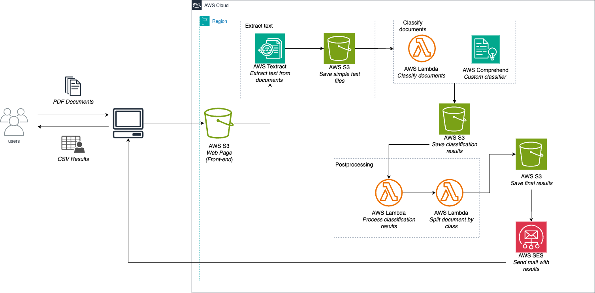
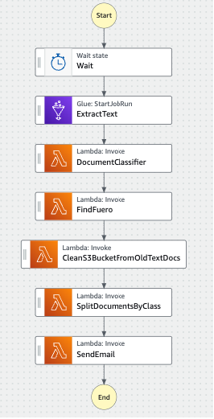

# IDP
Intelligent document processing with AWS.

Use case:

This is a law firm that would like to classify their documents automatically. The task is simple, the model should classify if a document requieres a legal action or not. Since this task requeries an attorney to complete it manually. Therefore, this solution is provided.

Architecture:

The architecture used is shown below (**this architecture is for demostration purpose. lambda functions are named different on the lambdaFunctions directory**).

Requirements:

* Some Lambda functions requiered to import pandas library. Which means that a lambda layer is needed.
* This is a partial solution. Should be integrated with Textract to get OCR function for extracting text from pdf documents.
* StepFunction includes a Glue Job for Textract use case.

Step-Function:

