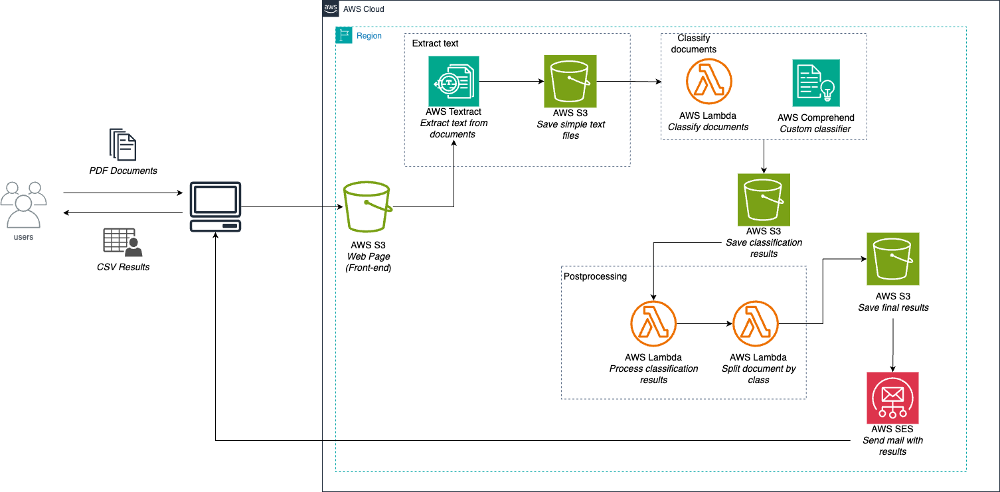

# IDP
Intelligent document processing with AWS.

The architecture used is shown below (**this architecture is for demostration purpose. lambda functions are named different on the lambdaFunctions directory**).

Requirements:

* Some Lambda functions requiered to import pandas library. Which means that a lambda layer is needed.
* This is a partial solution. Should be integrated with Textract to get OCR function for extracting text from pdf documents.
